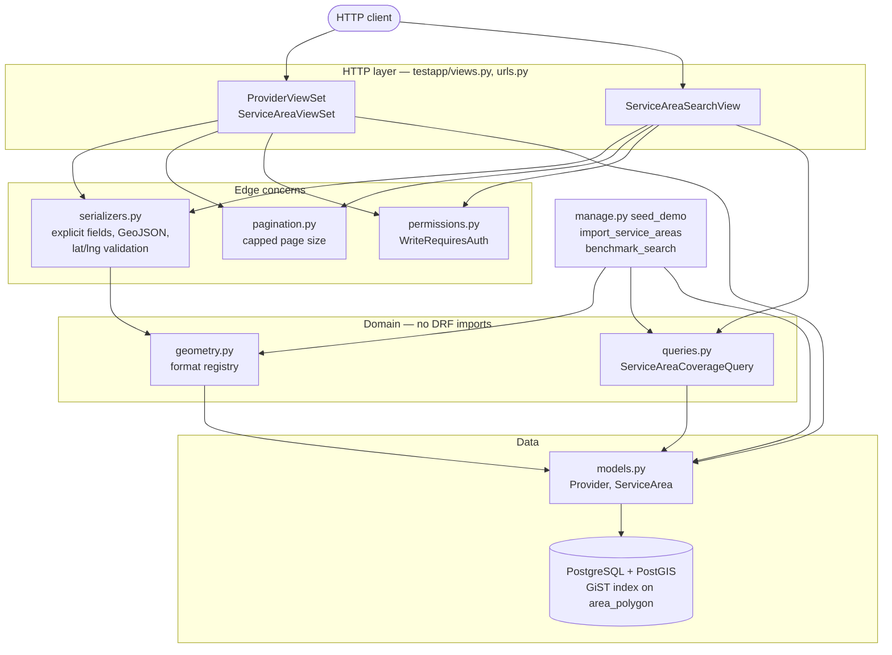
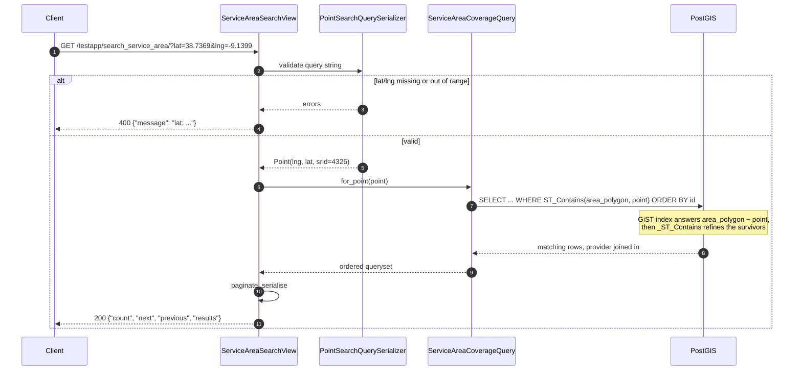

# Mozio Test Project

A GeoDjango + Django REST Framework service that stores transfer **providers**
and the priced **service areas** they cover, and answers one question fast:
*which service areas contain this coordinate?* The answer comes from a PostGIS
`ST_Contains` query against a GiST-indexed polygon column.

This is a technical assessment, kept deliberately small: two models, three
endpoints, one interesting query. The engineering interest is in how that query
is isolated, tested and shown to scale.

## Captured output

There is no UI beyond the Django admin and DRF's browsable API, so what follows
is real terminal output rather than screenshots. The full transcript is in
[`docs/api-session.md`](docs/api-session.md); the benchmark and query plans are
in [`docs/scalability.md`](docs/scalability.md).

The seeded Lisbon areas overlap on purpose, so a city-centre coordinate is
covered by two providers at two different prices:

```console
$ curl -s "$BASE/testapp/search_service_area/?lat=38.7369&lng=-9.1399" | python3 -m json.tool --compact
{"count":2,"next":null,"previous":null,"results":[{"id":1,"name":"Lisbon City","price":"24.50","area_polygon":{"type":"Polygon","coordinates":[[[-9.25,38.68],[-9.25,38.8],[-9.05,38.8],[-9.05,38.68],[-9.25,38.68]]]},"provider":1},{"id":3,"name":"Lisbon Centre Premium","price":"58.75","area_polygon":{"type":"Polygon","coordinates":[[[-9.2,38.7],[-9.2,38.76],[-9.1,38.76],[-9.1,38.7],[-9.2,38.7]]]},"provider":2}]}

$ curl -s "$BASE/testapp/search_service_area/?lat=0&lng=0" | python3 -m json.tool --compact
{"count":0,"next":null,"previous":null,"results":[]}

$ curl -s -w '\nHTTP %{http_code}\n' "$BASE/testapp/search_service_area/?lat=91&lng=-9.14"
{"message":"lat: Ensure this value is less than or equal to 90.0."}
HTTP 400
```

Invalid geometry is rejected before it reaches the table, because a
self-intersecting ring makes every later `ST_Contains` against it undefined:

```console
$ curl -s -X POST "$BASE/testapp/service_area/" -H 'Content-Type: application/json' \
    -d '{"name": "Bow tie", "price": "10.00", "provider": 1, "area_polygon": {"type": "Polygon", "coordinates": [[[0, 0], [10, 10], [10, 0], [0, 10], [0, 0]]]}}'
{"area_polygon":["invalid polygon: Self-intersection[5 5]"]}
HTTP 400
```

And the search is an index scan, not a table scan — measured over 100,000
polygons on PostgreSQL 17.6 / PostGIS 3.5.3:

```console
$ python manage.py benchmark_search --count 100000
...
search query over 25 runs: median 0.56 ms, min 0.53 ms, max 4.90 ms

--- EXPLAIN ANALYZE WITH the GiST index ---
Sort  (cost=29.27..29.27 rows=1 width=934) (actual time=0.022..0.022 rows=6 loops=1)
  ...
        ->  Index Scan using testapp_servicearea_area_polygon_id on testapp_servicearea  (cost=0.28..20.80 rows=1 width=152) (actual time=0.013..0.015 rows=6 loops=1)
              Index Cond: (area_polygon ~ '0101000020E6100000BA6B09F9A04722C011363CBD525E4340'::geometry)
              Filter: st_contains(area_polygon, '0101000020E6100000BA6B09F9A04722C011363CBD525E4340'::geometry)
              Buffers: shared hit=5
Execution Time: 0.028 ms

--- EXPLAIN ANALYZE WITHOUT any index ---
...
              ->  Parallel Seq Scan on testapp_servicearea  (cost=0.00..738098.66 rows=1 width=152) (actual time=0.002..4.721 rows=3 loops=2)
                    Filter: st_contains(area_polygon, '0101000020E6100000BA6B09F9A04722C011363CBD525E4340'::geometry)
                    Rows Removed by Filter: 50003
                    Buffers: shared hit=2128
Execution Time: 15.928 ms
```

## Architecture

The shape is **a thin HTTP layer over named query objects**, with a small
registry as the extension seam. Dependencies point inwards: views know about
queries, queries know about models, and nothing in `queries.py` or
`geometry.py` imports anything from `rest_framework`.



## The search request, end to end



## Quickstart

### Docker (one command)

```sh
docker compose up --build
```

That starts PostGIS, waits for it to be healthy, applies migrations, seeds a
demo dataset and an `admin` / `admin12345` superuser, then serves the API on
**http://localhost:8300**. Try it:

```sh
curl 'http://localhost:8300/testapp/search_service_area/?lat=38.7369&lng=-9.1399'
```

The database is also exposed on host port 8301 if you want to poke at it with
`psql`. Tear down with `docker compose down -v`.

> The compose stack is authored and `docker compose config` parses cleanly, but
> the image has not been built on this machine — see "Limitations".

### Without Docker

You need PostgreSQL with PostGIS, plus the GEOS and GDAL shared libraries that
GeoDjango loads through `ctypes`. Both ship with Postgres.app and with most
PostGIS packages.

```sh
python3.10 -m venv project_venv          # Django 3.2 does not support 3.11+
source project_venv/bin/activate
pip install -r requirements.txt

createdb mozio
psql -d mozio -c 'CREATE EXTENSION IF NOT EXISTS postgis;'

cp .env.example .env                     # then edit it
python manage.py migrate
python manage.py seed_demo
python manage.py runserver
```

## Configuration

Settings are read from the environment; `testproject/settings.py` also loads a
`.env` file from the project root at import time, and real environment
variables take precedence over it.

| Variable | Required | Default | What it does |
| --- | --- | --- | --- |
| `DJANGO_SECRET_KEY` | yes outside local dev | `django-insecure-local-dev-key` | Django secret key. |
| `DJANGO_DEBUG` | no | `true` | `true`/`false`. Set `false` for anything deployed. |
| `DJANGO_ALLOWED_HOSTS` | no | `127.0.0.1,localhost` | Comma-separated host list. |
| `DJANGO_LOG_LEVEL` | no | `INFO` | Level for the `testapp` logger. |
| `DJANGO_STATIC_ROOT` | no | `<project root>/staticfiles` | Where `collectstatic` writes; WhiteNoise serves from it. |
| `DJANGO_ENV_FILE` | no | `<project root>/.env` | Alternative location for the env file. |
| `POSTGRES_DB` | no | `django_test` | Database name. |
| `POSTGRES_USER` | no | `username` | Database user. Needs `CREATEDB` to run the test suite. |
| `POSTGRES_PASSWORD` | no | `password` | Database password. |
| `POSTGRES_HOST` | no | `localhost` | Database host. |
| `POSTGRES_PORT` | no | `5432` | Database port. |
| `POSTGRES_CONN_MAX_AGE` | no | `60` | Seconds a database connection is reused across requests. |
| `API_PAGE_SIZE` | no | `10` | Default rows per page on list endpoints. |
| `API_MAX_PAGE_SIZE` | no | `100` | Ceiling on `?page_size=`. |
| `API_REQUIRE_AUTH` | no | `false` | `true` keeps reads anonymous but requires an authenticated user for every write. |
| `GEOS_LIBRARY_PATH` | no | unset | Absolute path to `libgeos_c`, when auto-detection fails. |
| `GDAL_LIBRARY_PATH` | no | unset | Absolute path to `libgdal`, when auto-detection fails. |

Compose-only extras: `SEED_DEMO` (`true` runs `seed_demo` on boot) and
`DJANGO_SUPERUSER_USERNAME` / `_PASSWORD` / `_EMAIL` (creates an admin user if
one does not exist).

## API

Everything is mounted under `/testapp/`. List endpoints return
`{"count", "next", "previous", "results"}`.

| Method | Path | Purpose |
| --- | --- | --- |
| `GET` `POST` | `/testapp/provider/` | List and create providers |
| `GET` `PUT` `PATCH` `DELETE` | `/testapp/provider/<id>/` | Single provider |
| `GET` `POST` | `/testapp/service_area/` | List and create service areas |
| `GET` `PUT` `PATCH` `DELETE` | `/testapp/service_area/<id>/` | Single service area |
| `GET` | `/testapp/search_service_area/?lat=&lng=` | Areas containing a point |

**Provider** — `name` (≤60), `email` (unique), `phone` (unique, matches
`^\+?1?\d{9,15}$`, or `null` for "no phone"), `language`, `currency`.

**Service area** — `name` (≤60), `price` (up to `9999.99`), `provider` (id),
`area_polygon` (GeoJSON `Polygon`, SRID 4326, optional). Polygons must be
valid; self-intersecting rings are rejected with `400`.

**Search** — `lat` in `[-90, 90]` and `lng` in `[-180, 180]`, both required.
Returns `400 {"message": "..."}` on bad input and `405` for any method other
than `GET`. A point exactly on a polygon boundary is **not** contained.

## Development

```sh
python manage.py test                 # 82 tests, real PostGIS test database
python manage.py test testapp.tests.test_queries   # one module

pip install -r requirements-dev.txt
ruff check .                          # lint + import order
black --check .                       # formatting (line length 90)

python manage.py seed_demo --flush                        # reset demo data
python manage.py import_service_areas examples/service_areas.json --dry-run
python manage.py benchmark_search --count 100000          # plans and timings
```

The suite talks to a real PostGIS database — there is no SQLite fallback,
because the behaviour under test *is* the PostGIS behaviour. Django creates and
drops `test_<POSTGRES_DB>` and enables the extension on it, so the database user
needs `CREATEDB`.

## Project structure

```
manage.py                       Django entry point
Dockerfile                      Multi-stage build; non-root runtime, gunicorn
docker-compose.yml              PostGIS + API on host ports 8300/8301
docker/entrypoint.sh            Wait for DB, migrate, seed, exec the command
pyproject.toml                  ruff and black configuration
requirements.txt                Runtime pins
requirements-dev.txt            Lint/format tooling
examples/service_areas.json     Sample import payload
docs/
    api-session.md              Captured request/response transcript
    scalability.md              EXPLAIN ANALYZE, benchmark, index reasoning
testproject/
    settings.py                 Env-driven settings, DRF and GIS config
    urls.py                     Mounts /testapp/ and /admin/
testapp/
    models.py                   Provider, ServiceArea, default ordering
    queries.py                  ServiceAreaCoverageQuery — the spatial lookup
    geometry.py                 Geometry format registry and normalisation
    serializers.py              Explicit wire format, GeoJSON, query validation
    views.py                    Viewsets and the search view; no SQL here
    pagination.py               Capped page-number pagination
    permissions.py              WriteRequiresAuth
    admin.py                    Admin registration for both models
    urls.py                     Router plus the search route
    management/commands/        seed_demo, import_service_areas, benchmark_search
    tests/                      Split by layer; see below
    migrations/                 Schema history
```

Tests are split so a failure names its layer: `test_models.py`,
`test_queries.py`, `test_geometry.py`, `test_permissions.py`,
`test_provider_api.py`, `test_service_area_api.py`, `test_search_api.py`, with
shared fixtures in `tests/factories.py`.

## Design notes

### The spatial query is an object, not a line in a viewset

The point-in-polygon lookup is the whole point of this service, and it has three
ways to be subtly wrong: the SRID can mismatch, `Point` takes `(x, y)` so
latitude and longitude can be swapped silently, and an unordered queryset paged
by `LIMIT/OFFSET` can return the same row twice. Putting it in
`ServiceAreaCoverageQuery` gives all three a single home, a docstring explaining
the operator choice, and direct unit tests — including one that asserts a
wrong-SRID point raises rather than quietly returning nothing. The view is left
with parsing and serialising, which is all an HTTP layer should do.

The query object takes an optional base queryset, so narrowing the search (to
one provider, say) reuses the spatial part instead of reimplementing it.

### Scalability: the index, and what it is actually worth

Full detail and plans in [`docs/scalability.md`](docs/scalability.md). In short:

* `PolygonField` defaults to `spatial_index=True`, so migration `0007` emits
  `CREATE INDEX ... USING GIST ("area_polygon")` next to the `ADD COLUMN`. A
  test reads `pg_am` and fails if that index ever disappears.
* PostGIS rewrites `ST_Contains(A, B)` as `A ~ B AND _ST_Contains(A, B)`. The
  bounding-box half is served from GiST; the exact predicate only runs on the
  survivors. At 100,000 polygons that is 0.028 ms and 11 buffers, against
  15.9 ms and 2,134 buffers with index scans disabled.
* The honest conclusion is that **the spatial query is not the bottleneck**. The
  end-to-end median is 0.56 ms, and the difference between that and 0.028 ms is
  Python, psycopg2 and GEOS deserialising the polygons being returned. Response
  size is what will hurt first at scale, not the index.

Three other unbounded-work problems were closed: list endpoints have a
deterministic `ORDER BY` (models carry `Meta.ordering`, so even a queryset that
reaches the paginator without an explicit `order_by` pages consistently),
`?page_size=` is capped at `API_MAX_PAGE_SIZE` so a client cannot ask for the
whole table, and the search joins the provider with `select_related` so a page
of results costs one query rather than eleven — asserted by
`assertNumQueries(0)` in `test_queries.py`.

### Extensibility: one seam, at the geometry boundary

The realistic change to this service is provider onboarding: today areas arrive
as GeoJSON over the API, tomorrow a partner hands over a WKT dump. So
`geometry.py` holds a small name → reader registry, with `geojson` and `wkt`
registered, and a single `normalise_polygon` that enforces the invariants —
polygon, valid, SRID 4326 — for every path into the database. Adding a format is
one function and one decorator; `import_service_areas --format` picks up new
entries automatically because its `choices` come from the registry.

That is deliberately the *only* seam. A pricing-strategy interface or a pluggable
geometry backend would be speculative here; the geometry boundary is the one
place this codebase already has more than one caller.

### Authentication: documented, switchable, still open by default

Every endpoint is unauthenticated, which for a public API that lets anyone
`DELETE /testapp/provider/1/` would be a serious finding. It stays that way
because the assessment's documented surface is an open API, and silently
requiring credentials would change the thing being assessed.

Rather than only writing that down, the decision is now a switch. DRF's default
permission class is `testapp.permissions.WriteRequiresAuth`, which reads
`settings.API_REQUIRE_AUTH` per request: with it off nothing changes, with it on
reads stay anonymous and every write needs an authenticated user. Session and
basic authentication are configured, so `curl -u` works out of the box. Both
modes are covered by `test_permissions.py`, and a captured transcript of the
switched-on behaviour is in [`docs/api-session.md`](docs/api-session.md).

A real deployment would set `API_REQUIRE_AUTH=true` and put a token or JWT
backend in `DEFAULT_AUTHENTICATION_CLASSES`. That is a one-line settings change
against this structure.

### What was deliberately not added

No AI features and no new product functionality. This is an interview
assessment: the reviewer is reading it to judge how a small, well-specified
problem is handled, and bolting on extras reads as scope creep. The uplift went
into architecture, tests, measurement and documentation instead.

Django 3.2 was **not** upgraded, for the same reason — the assessment was
written against it, and a framework jump would rewrite far more than it proves.

## Limitations

- **Unauthenticated by default.** See "Design notes → Authentication". The
  switch exists; the default is open, on purpose.
- **The Docker image has not been built here.** `docker compose config` parses
  cleanly and the Dockerfile and entrypoint are written to be complete, but the
  build and boot were not run on this machine. Treat compose as unverified until
  you have run `docker compose up --build` once.
- **No SQLite fallback.** The tests need a real PostGIS database, because the
  behaviour under test is PostGIS behaviour.
- **`area_polygon` is optional and nullable**, so an area with no polygon is
  never returned by the search. That matches the original schema and is left
  alone.
- **The search returns full polygons.** Fine for the current response contract,
  but it is the first thing that will need trimming at scale.
- **TLS-related settings are left unset.** `manage.py check --deploy` reports
  `SECURE_SSL_REDIRECT`, `SESSION_COOKIE_SECURE`, `CSRF_COOKIE_SECURE` and HSTS
  as missing. That is deliberate: enabling them would break the plain-HTTP
  compose demo this README tells you to run, and they belong to a deployment
  story this assessment does not have. `SECURE_CONTENT_TYPE_NOSNIFF` and
  `X_FRAME_OPTIONS = DENY`, which cost nothing locally, are set.
- **No rate limiting, no caching, no async work.** Nothing here needs a queue:
  the single interesting operation is a sub-millisecond read.
- **Django 3.2 is past end of life** (April 2024). It also omits ctypes
  `argtypes` on `GEOSGeom_createPolygon`, so the `Polygon(...)` constructor can
  fail against recent GEOS builds on arm64. Building geometries from WKT or
  GeoJSON through `GEOSGeometry` works regardless, which is what the app, the
  fixtures and the tests all do.
